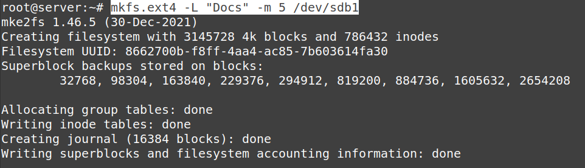

## Блочное устройства
1. Вывести информацию о контролерах дисков, которые сейчас доступны в виртуальной машине.
    * `sudo lshw -c disk` - смотрим детальную информацию о дисках
      * 
    * `sudo hdparm -I /dev/sda` - смотрим параметры жесткого диска
      * 
2. Вывести информацию о блочных устройствах, которые сейчас доступны в виртуальной машине.
    * `lsblk` - смотрим какие есть блочные устройства
      * 
3. Завершить (выключить) виртуальную машину
    * `sudo poweroff`
4. Подключить к виртуальной машине новый контролер дисков с типом AHCI (SATA).
   * virtual box не давал создать новый контроллер типа AHCI (SATA), поэтому добавил новый диск в имеющийся
5. К контроллеру AHCI (SATA) подключить динамический виртуальный диск в формате VDI размером 30 Гб.
   * 
6. Включить виртуальную машину.
7. Определить файл-устройство, которое соответствует добавленному диску.
    * Это **sdb**
      * 
8. На добавленном диске разметить таблицу разделов в формате GPT (GUID Partition Table) и создать следующие разделы:
   * Раздел с названием Docs размером 12 Гб и типом Linux filesystem data.
     * 
   * Раздел с названием Works размером 18 Гб и типом Linux filesystem data.
     *  
   * 
   * `fdisk /dev/std` - начало разметки диска
   * `w` - сохранить
   * `g` - создание GPT-раздела
   * `p` - сведения о разделах
   * `n` - создание раздела. Для первого раздела указываем 12Gib, второй заполняется автоматически по оставшемуся месту
9. На разделах создать файловые системы (отформатировать):
   * Раздел Docs в файловую систему ext4 для пользователя root зарезервируйте 5 %.
     * 
     * `mkfs.ext4 -L "Docs" -m 5 /dev/sdb1` - создание файловой системы типа `ext4` с меткой `Docs` и с резервом в 5%
   * Раздел Works в файловую систему ext4 для пользователя root зарезервируйте 7 %.
     * 
     * `mkfs.ext4 -L "Works" -m 7 /dev/sdb2` - создание файловой системы типа `ext4` с меткой `Works` и с резервом в 7%
10. При загрузке операционной системы созданные файловые системы должны монтироваться автоматически:
    * Чтобы операционная система при загрузке автоматически монтировала созданные файловые системы добавляем следующие строчки в `/etc/fstab`
      * `/dev/sdb1	/media/docs	ext4	defaults	0	1` (Второй раздел аналогично)
        * `dev/sdb1` - диск, который мы монтируем
        * `/media/docs` - каталог, в который монтируем диск
        * `ext4` - файловая система
        * `defaults` - стандартные опции
        * `0 1` - первый отключает резервные копии, второй включает проверку диска
    * Файловая система на разделе Docs в директорию /media/docs, Файловая система на разделе Works в директорию /media/works
      * 
    * `mkdir -p /media/docs /media/works` - создаем точки монтирования
    * `mount /media/docs` - вручную монтируем для перестраховки
    * `mount /media/works` - вручную монтируем для перестраховки
      *  (Успешно)
    * `reboot` - проверяем, будут ли файловые системы автоматически монтироваться после перезагрузки ВМ
      *  (Успешно)

## Пользователи и группы

1. В операционной системе необходимо создать следящие группы пользователей:
   * developers, managers, writers
     * `sudo addgroup developers`
     * `sudo addgroup managers`
     * `sudo addgroup writers`
2. Создать пользоавтелей и добавить в группы:
   * Пользователей woody, buzz добавить в группу developers.
   * Пользователей potato, slinky добавить в группу managers.
   * Пользователи rex, sid добавить в группу writers.
   * 
   * 

## Директории и файлы
1. В директории /media/docs необходимо создать поддиректории и назначить им владельцев и права, как указано в следующей таблице:
   * `cd /media/docs` - переходим в директорию. Далее создаем поддиректории:
     * `mkdir manuals`
     * `mkdir reports`
     * `mkdir todo`
   * `ls -l` - выводим подробный список, в котором будет отображаться владелец, группа, дата создания, размер итд
   *  - создано
   * Меняем владельца и группы для директорий:
     * `chown rex:writers mannuals`
     * `chown potato:managers reports`
     * `chown woody:developers todo`
     * 
   * Меняем права доступа:
     * `chmod 2755 manuals` - `rwx rws r-x`
     * `chmod 2770 reports` - `rwx rws ---`
     * `chmod 0755 todo` - `rwx r-x r-x`
     * 
2. В директории /media/works необходимо создать поддиректории и назначить им владельцев и права, как указано в следующей таблице:
   * `cd /media/works` - переходим в директорию. Далее создаем поддиректории:
     * `mkdir writers`
     * `mkdir managers`
     * `mkdir developers`
     * 
   * Меняем владельца и группы для директорий:
     * `chown rex:writers writers`
     * `chown potato:managers managers`
     * `chown woody:developers developers`
     * 
   * Меняем права доступа:
     * `chmod 2770 writers` - `rwx rws ---`
     * `chmod 2770 managers` - `rwx rws ---`
     * `chmod 2770 developers` - `rwx rws ---`
     * 
3. В директории `/media/works/developers` создать символьные ссылки:
   * Имя ссылки `docs` ссылается на `/media/docs/manuals`
     * `ln -s /media/docs/manuals developers/docs` - создание символьной ссылки docs
       * 
   * Имя ссылки `todo` ссылается на `/media/docs/todo`
     * `ln -s /media/docs/todo developers/todo` - создание символьной ссылки todo
       * 